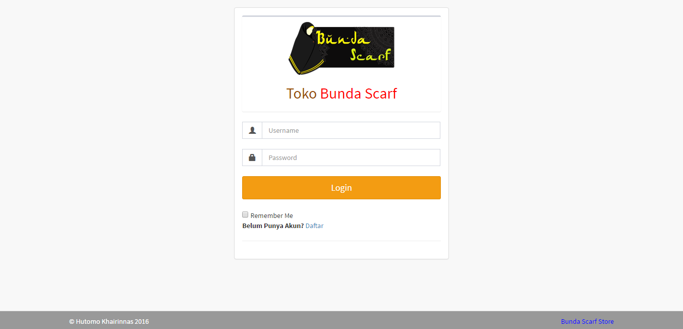
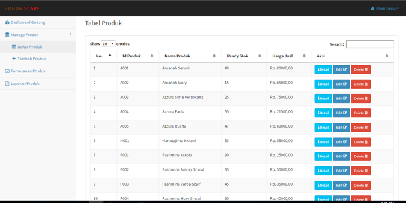

# Bunda Scarf Inventory Management System and Point of Sale

Merupakan Store yang bergerak pada Penjualan Gorden dll. berisi Sistem Informasi Inventory beserta Point Of Sale yang simple.

How To
----------------
Panduan Instalasi [Bunda-Scarf Wiki](https://github.com/tommyhawk95/Bunda-Scarf) dapat dilihat di https://github.com/tommyhawk95/Bunda-Scarf/wiki

Tampilan Login

Tampilan Produk

Feel Free To Use this Source Code for Developing or References.

Source Code Ini Gratis, Silahkan digunakan untuk keperluan Pengembangan, Tugas Akhir/Skripsi, dan juga sebagai Referensi.
Contact Me  : https://hkhairinas.github.io/

Copyright © 2017-2018 Hutomo Khairinas
